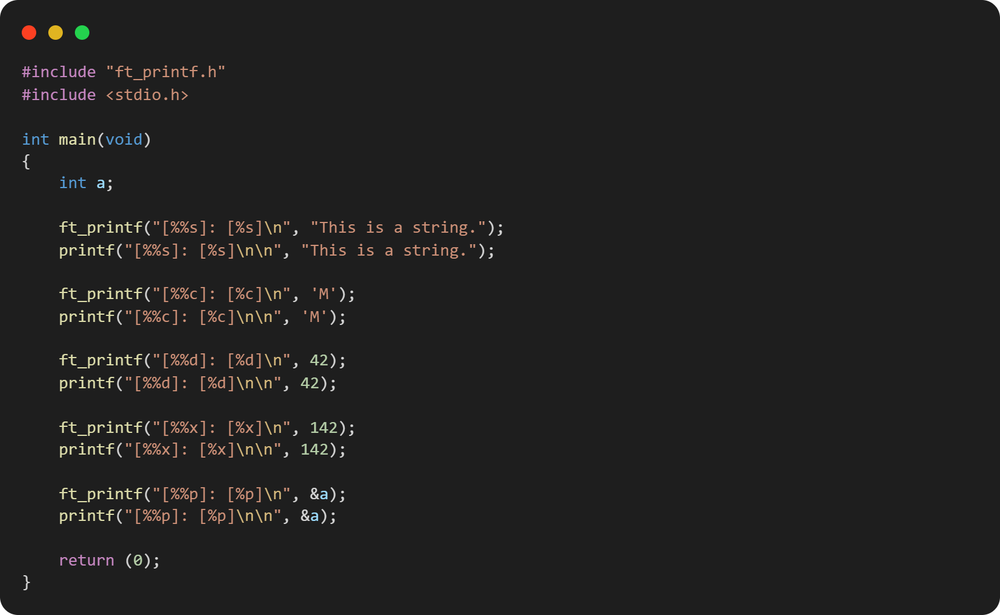
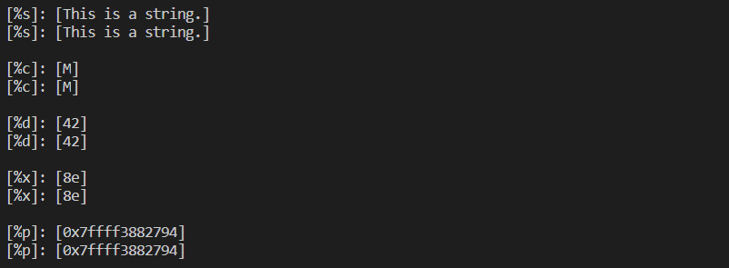

# ft_printf - @42born2code


### Table of Content

* [What is ft_printf?](#what-is-ft_printf)
* [Features](#features)
* [Installation](#installation)
* [Compilation](#compilation) 
* [Usage (some examples)](#usage-some-examples)

## What is ft_printf?
Regardless of the programming language considered, the ``printf`` function, (or its equivalents) is always highly useful. The main reason is the ease of its formatting, and the support of diverse types in variable numbers. In short, undeniably, printf is a vital function. In this project, we are ask to recode it and add it to our libft so that we can use it in all of our future projects.

The versatility of the printf function in C represents a great exercise in programming for us. It allow us to discover a feature of the C language – variadic functions – and to practice detailed management of the printing options.

## Features
The prototype of ft_printf should be:
```C 
int	ft_printf(const char *, ...); 
```
External functions allowed:
`` malloc, free, write, va_start, va_arg, va_copy, va_end ``

It will manage the following conversions: ``c s p d i u x X %``

Conversions:
```
%                   (% character)
c    char           (character)
s    char *         (string)
p    void *         (pointer's address)
u    unsigned int   (unsigned decimal integer)
x/X: unsigned int   (hexadecimal)
d/i: int            (integer)
```
My ft_printf will manage any combination of the following flags: ``-0.*`` and minimum field width with all conversions.

Placeholders: 

``
%[Flags][Width][.Precision][Length]<type>
``

**Flags:**
```
-       Left alignment. (default rigth aligned)
0       Field is padded with 0's instead of space.
.       Precision
*       The width or precision is not specified in the format string, 
        but as an additional integer value argument (given by the next va_arg)
```
**Width:** Minumum number of characters to output (pads if necessary)

**Precision:** Maximum limit of characters to output (rounds if necessary)

## Installation
```
git clone https://github.com/vvarodi/ft_printf
cd ft_printf
make
```
## Compilation
Then compile your file with the generated ``libftprintf.a`` by adding in the main

``` C
#include "ft_printf.h"
````
(You can compare it with the real printf ``#include <stdio.h>``)
```
gcc main.c libftprintf.a
./a.out
```
## Usage (some examples)
Basic conversions:


